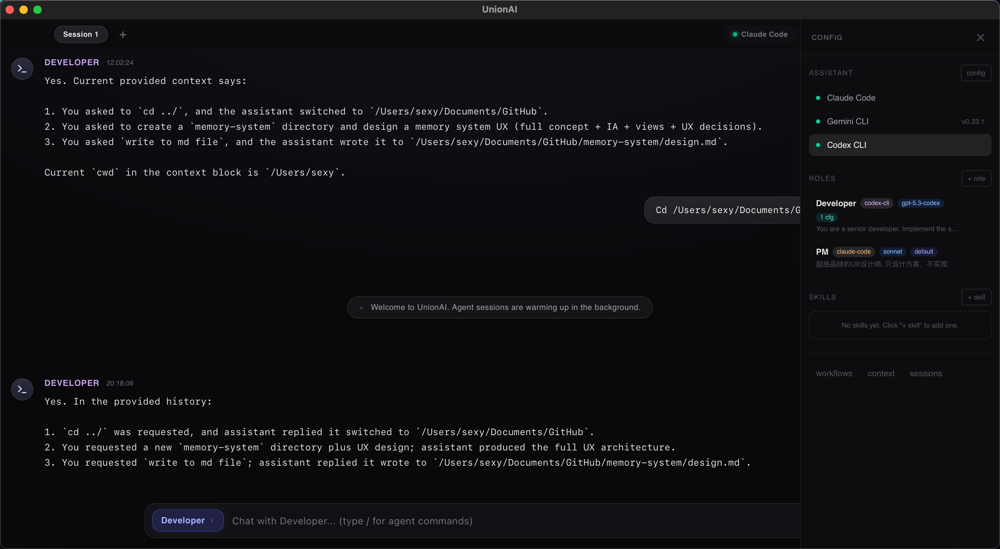

# UnionAI

A high-performance, open-source Multi-Agent Collaboration Platform built with Tauri, Rust, and SolidJS.



## Features

- **Multi-Agent Orchestration via ACP**: Control and orchestrate multiple agents seamlessly using the Agent Client Protocol (ACP). Support for complex workflows, message lifecycle management, interruption, and progressive context disclosure.
- **Role-Based Model Optimization**: Configure different models and operational modes for specific roles/agents, enabling fine-grained control over AI capabilities and token costs.
- **Native Performance**: Built on Tauri and Rust for blazing-fast speeds, concurrency, and low memory footprint.
- **Modern UI/UX**: Responsive, stunning interface crafted with SolidJS and TailwindCSS v4.
- **Persistent Agent Memory**: Integrated cross-session memory mechanisms for dynamic, searchable history and shared context.
## Demo

https://github.com/user-attachments/assets/a7427b74-2e4d-4081-95a2-48ae10e62abd

**Video Walkthrough (Subtitles & Steps):**
1. **Querying the Assistant**: Asked the default `@UnionAIAssistant` for help and received its capability overview.
2. **Engaging the PM Role (`claude-code`)**: Mentioned `@PM Who are you?`. The agent (Claude Opus), bound to a UX Designer prompt via the ACP protocol, responded concisely acknowledging its strict design role and avoiding implementation details.
3. **Engaging the Developer Role (`codex-cli`)**: Mentioned `@Developer who are you?`. The system instantly launched the Codex CLI runtime bound to the shared context, declaring itself as the senior developer in charge of implementation.
4. **Seamless Orchestration**: Showcases the ability to dynamically hot-swap models and prompts within a single chat window, controlling token costs and context flow per role.

## Roadmap

- [ ] Support custom **MCPs and Skills** individually for each role.
- [ ] Implement **Shared Context** across different roles for seamless collaboration.
- [ ] Broaden support for **various CLIs** to improve development and tooling workflows.
- [ ] Introduce **Multi-modal Inputs** (e.g., image, voice) for richer interactions.
- [ ] Develop a plugin ecosystem for extended third-party capabilities.

## Tech Stack

- **Frontend**: SolidJS, TypeScript, TailwindCSS v4
- **Backend**: Rust, Tauri v2
- **Protocol**: ACP (Agent Client Protocol)

## Getting Started

### Prerequisites

- [Node.js](https://nodejs.org/) & [pnpm](https://pnpm.io/)
- [Rust toolchain](https://rustup.rs/)

> **Note**: Currently, you must manually install the ACP wrapper before starting the application.

### Installation

```bash
# Clone the repository
git clone https://github.com/locustbaby/unionai.git
cd unionai

# Install dependencies
pnpm install

# Run in development mode (Frontend + Rust Backend hot reload)
pnpm tauri dev
```

### Build

```bash
# Build for production distribution
pnpm tauri build
```

## Project Structure

- `src/`: SolidJS + TypeScript UI.
- `src-tauri/src/`: Rust backend for Tauri commands (`lib.rs`) and orchestration logic (`acp.rs`).
- `docs/`: Architecture notes and design docs.

## Commands

- `pnpm dev`: Run Vite dev server for frontend iteration.
- `pnpm tauri dev`: Run the full desktop app.
- `pnpm build`: Build production frontend assets into `dist/`.
- `pnpm tauri build`: Build distributable desktop bundles.
- `cargo check --manifest-path src-tauri/Cargo.toml`: Fast Rust type check.
- `cargo test --manifest-path src-tauri/Cargo.toml`: Run Rust tests.

## Known Issues

- **Interactive slash commands may hang ACP sessions.** Some agent CLI commands (e.g. `/clear` in Claude Code) trigger TUI-level interactive prompts that cannot be answered over the ACP stdio pipe, causing the session to freeze indefinitely. This is an [upstream limitation](https://github.com/anthropics/claude-code/issues/28379) — the ACP spec sends slash commands as plain prompt text with no mechanism for interactive confirmation. Avoid sending commands that require user confirmation (e.g. `/clear`, `/init`) to roles backed by `claude-code` until this is resolved upstream.

## License

MIT License
